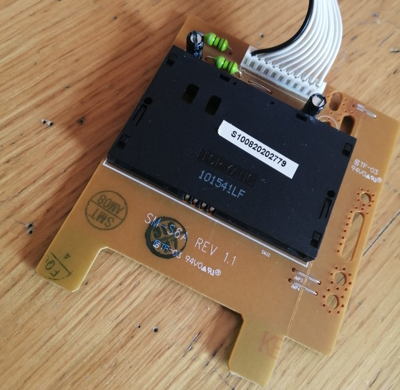
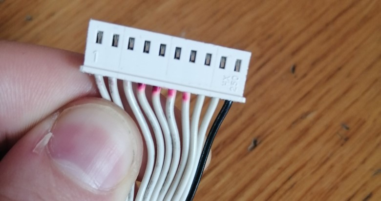

# SmartCard-Interface

### Story
I discovery a PCB in a old packet, this PCB is use to read a smartcard and now I have thinked that this can be reused.

## Mode
For read and process the data of the smartcard reader, I use an Arduino.
The datas are pass to this output PINs.

All information of the PIN can be found in the datasheet.

## Functionality
- Identify the occurrence of the card;
- Read the data of the card; (WIP)
